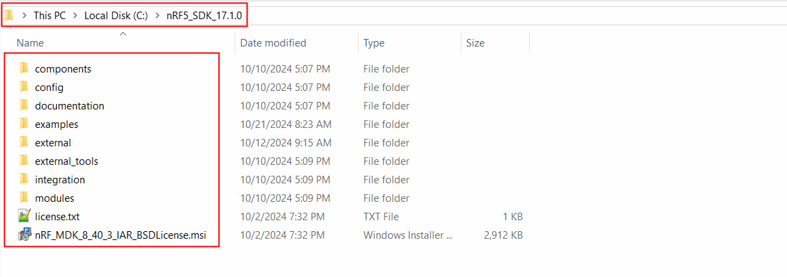

# Installation

### SDK
**sdk5 17.1.0**

sdk5 17.1.0 совместима с SES 5.42a


```
The following toolchains/devices have been used for testing and verification:
 
 - ARM: MDK-ARM version 5.25   
 - GCC: GCC ARM Embedded 9.2020-q2.major
 - IAR: IAR Workbench 7.80.4
 - SES: SES 5.42a
```

При запуске выбирать некоммерческое использование


### Загрузка проекта

После подключения выбираем

***Target -> Connect J-Link***


Затем можно загрузить проект


### Project path

Путь для SDK

```
C:\nRF5_SDK_17.1.0\

```



Общий путь

```
C:\nRF5_SDK_17.1.0\examples
```

заходим в директорию "examples" и загружаем репозиторий с git

```bash
C:\nRF5_SDK_17.1.0\examples\>git clone git@github.com:IvanFedirko/bike_shifter.git
```

Полный путь до проекта должен получиться

```
C:\nRF5_SDK_17.1.0\examples\bike_shifter
```

# Управление светодиодами (led_control)

Откройте Решение (SEGGER: File -> Open Solution)

```
C:\nRF5_SDK_17.1.0\examples\bike_shifter\led_control\pca10056\blank\ses\led_control.emProject
```

Светодиоды подключены через VDD (active LOW), следовательно  **nrf_gpio_pin_set** - отключает, **nrf_gpio_pin_clear** - включает  и **nrf_gpio_pin_toggle** - переключает

* LED_BLUE **P0.28**
* LED_GREEN **P0.03**
* LED_RED **P0.02**


# Управление кнопкой (button_control)

```
C:\nRF5_SDK_17.1.0\examples\bike_shifter\button_control\pca10056\blank\ses\button_control.emProject
```

Кнопка подключена на ***P0.29 = gpio pin 29***

Кнопка замыкает на **плюс**, следовательно делаем ее активной в высоком, и подключаем стягивающий резистор


```c
 nrf_gpio_cfg_input(button, NRF_GPIO_PIN_PULLDOWN);
```

Чтение кнопки

```c
   if (nrf_gpio_pin_read(button) == 1){}
```


# Глубокий сон и пробуждение по движению

```
C:\nRF5_SDK_17.1.0\examples\bike_shifter\deep_sleep\pca10056\blank\ses\deep_sleep.emProject
```

Строки для того чтобы войти в Сон

```
  __SEV();
  __WFE();
  NRF_POWER->SYSTEMOFF = 1;
```

После пробуждения плата стартует с функции **main**

# Энкодер

Пин питания AS5600 P1.08 = пин №40

```
C:\nRF5_SDK_17.1.0\examples\bike_shifter\encoder\pca10056\blank\ses\encoder.emProject
```
